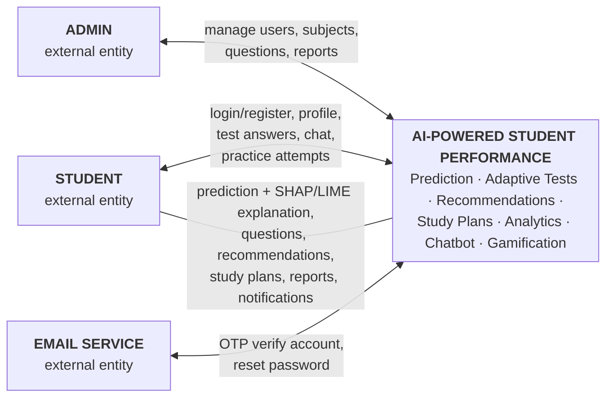
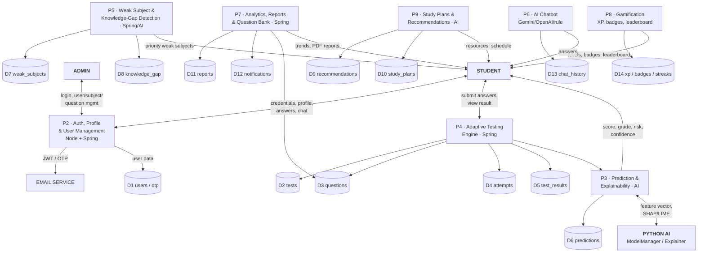
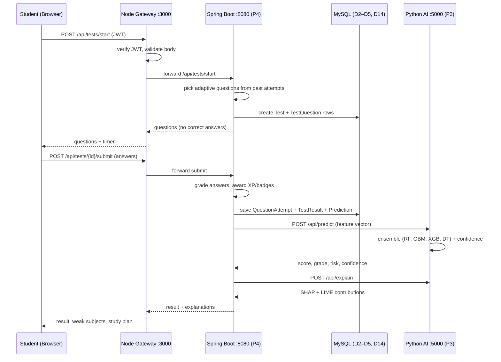

# Data Flow Diagrams (DFD)

System: **AI-Powered Student Performance Prediction & Personalized Learning System**

The diagrams below use Mermaid and render on GitHub / any Mermaid-capable viewer.
If the diagrams appear as code, open this file in GitHub, VS Code (with Markdown
Preview), or https://mermaid.live.

---

## DFD Level 0 — Context Diagram

The entire system is a single process. External entities interact with it through
login, profile data, test answers, chat messages, content management and OTP email.

**External entities**

| Entity | Description |
|--------|-------------|
| Student | Registers/logs in, supplies profile & academic data, takes adaptive tests, views predictions, reports and study plans, chats with the AI. |
| Admin   | Manages platform: users, subjects, question bank; views platform stats and generated reports. |
| Email Service | Receives OTP requests to verify accounts / reset passwords and delivers codes. |

**Main data flows**

| Direction | Flow |
|-----------|------|
| Student → System | credentials, profile updates, test answers, chat messages, practice submissions |
| System → Student | predictions + SHAP/LIME explanations, adaptive questions, recommendations, study plans, reports, notifications |
| Admin → System | admin credentials, content-management data, user moderation |
| System → Email | OTP verification / password-reset codes |

---

## DFD Level 1 — System Decomposition

The system decomposes into nine processes. All persistent data lives in **MySQL 8**
(D1–D14). The **Python AI service** owns prediction, explainability, recommendations,
study-planning and the chatbot (processes P3, P5, P6, P9).

**Processes**

| ID | Process | Layer |
|----|---------|-------|
| P2 | Auth, Profile & User Management — login/register, JWT, OTP email, profile uploads | Node gateway + Spring Boot |
| P3 | Performance Prediction & Explainability — 4-model ensemble, SHAP/LIME, confidence | Python AI |
| P4 | Adaptive Testing Engine — adaptive question selection, grading, auto-submit on expiry | Spring Boot |
| P5 | Weak Subject & Knowledge-Gap Detection — mastery per topic, priority ranking | Spring Boot + stored procs + AI |
| P6 | AI Chatbot — Gemini → OpenAI → rule-based fallback | Python AI |
| P7 | Analytics, Reports & Question Bank — trends, PDF reports, 3,000-MCQ bank | Spring Boot |
| P8 | Gamification + Notifications — XP, levels, badges, streaks, leaderboard | Spring Boot |
| P9 | Study Plans & Recommendations — content-based resources, day-by-day planner | Python AI |

**Data stores (MySQL 8, 20 tables)**

| Store | Content |
|-------|---------|
| D1  | users, roles, otp, login_history |
| D2  | tests (adaptive/practice/chapter/final) |
| D3  | questions (3,000 MCQs seeded) |
| D4  | test_questions, practice_questions |
| D5  | test_results (correct/incorrect/skipped, grade) |
| D6  | predictions (model, score, risk, confidence, feature importance JSON) |
| D7  | weak_subjects (weakness score, priority rank) |
| D8  | knowledge_gap (mastery, gap level, recommended hours) |
| D9  | recommendations (resource, type, reason, viewed) |
| D10 | study_plans + study_plan_tasks |
| D11 | reports (weekly/monthly/semester/prediction, PDF url) |
| D12 | notifications |
| D13 | chat_history |
| D14 | badges, student_badges, rewards (XP log) |

---

## DFD Level 2 — Adaptive Test Flow (example)

Detail of the end-to-end adaptive-testing path (P4 → P3) for the Student.

